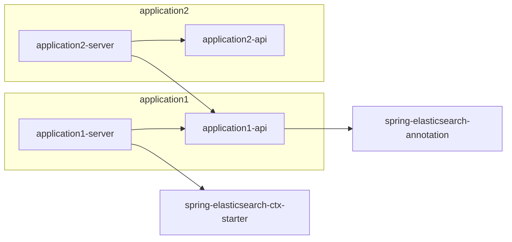

# ElasticSearch集成式查询框架

众所周知，ElasticSearch（后面统一称ES）的原生客户端没那么好用且版本兼容性一般，大版本更新后导致很多API要重新编写，所以此项目目的有两个主要目的

- ES与应用解耦。这样更新ES无需再更改应用里的代码，统一由此项目负责更改不兼容的部分
- 减低调用ES的上手难度。原先不熟练ES的DSL语法的人也可以做到简单的增删改查。

---


## 项目结构

此项目分为两个工程

- spring-elasticsearch-annotation。包含了一些基础的实体和注解
-  spring-elasticsearch-ctx-starter。真正实现的ES客户端的工程

依赖信息

```xml
 <dependency>
    <groupId>net.evecom</groupId>
    <artifactId>spring-elasticsearch-ctx-starter</artifactId>
    <version>7.17.4</version>
</dependency>
<dependency>
    <groupId>net.evecom</groupId>
    <artifactId>spring-elasticsearch-annotation</artifactId>
    <version>7.17.4</version>
</dependency>
```


<mark>这样的项目解耦是为了针对现阶段微服务对外的接口包，只需要实体等基本信息。</mark>



## 快速上手

**引入依赖**


```xml
 <dependency>
    <groupId>net.evecom</groupId>
    <artifactId>spring-elasticsearch-ctx-starter</artifactId>
</dependency>
```


***在Spring配置文件中配置**

```yaml
elastic:
  cluster-nodes: 172.16.40.238:31006
  username: username
  password: password
```


**定义实体类**


```java
@ElasticIndex("es_test")
public class Student implements EsBaseEntity {

    private String id;

    @HigLight
    @ElasticQueryField(operator = ElasticOperator.MATCH,name = "name")
    private String name;
    @ElasticQueryField(operator = ElasticOperator.TERM,name = "age")
    private String age;
    @ElasticQueryField(operator = ElasticOperator.TERM,name = "sex")
    private String sex;
    
    ...get()/set()...
    
    @Override
    public String getId() {
        return id;
    }

    @Override
    public void setId(String id) {
        this.id=id;
    }
}
```

- EsBaseEntity,这个是表示ES的实体类，实际查询类和数据映射实体类应该分开，我上面是为了方便写才合并。
- @ElasticIndex("es_test")，表示搜索的索引为“es_test”
- @ElasticQueryField，表示查询的字段名称为name。
- @HigLight，表示查询字段name的时候，命中则高亮


**查询ES**

```java
 @Autowired
 private ElasticSearch elasticSearch; 


/**效果等同于
GET es_test/_search
{
  "from": 0,
  "highlight": {
    "fields": {
      "name": {}
    }
  },
  "query": {
    "bool": {
      "must": [
        {
          "match": {
            "name": {
              "boost": 1,
              "query": "王"
            }
          }
        }
      ]
    }
  },
  "size": 20
}
*/
@Test
public void search(){
        Student student=new Student();
        student.setName("王");
        EPageRequest<Student> pageRequest=new EPageCondition<>();
        pageRequest.setSize(20);
        EsQueryWrapper<Student> studentEsQueryWrapper=new EsQueryWrapper<>(student)。;
        EPageRequest<Student> studentEPageRequest=elasticSearch.searchByObj(studentEsQueryWrapper,pageRequest,Student.class);
        }

@Test
public void search1(){
        ESimpleQueryWrapper esTest = new ESimpleQueryWrapper("es_test",false);
        ESearchValue eSearchValue=new ESearchValue("name","王", ElasticOperator.MATCH, ElasticBoolType.MUST);
        esTest.append(eSearchValue);
        studentEPageRequest=elasticSearch.searchByObj(esTest,pageRequest,Student.class);
        }


@Test
public void insert(){
        Student student1=new Student();
        student1.setName("李六");
        student1.setId("12");
        elasticSearch.insert(true,student1,student2);
        }

@Test
public void update(){
    Student student1 = new Student();
    student1.setName("李六");
    student1.setId("12");
    elasticSearch.updateById(true, student1);//这里是upsert，即如果不存在则插入。
}

@Test
public void deleteById(){
    
    elasticSearch.deleteById(true, "12");
}


```


## 注解

| 名称                     | 说明                                                         |
| ------------------------ | ------------------------------------------------------------ |
| @ElasticIndex            | 表明实体类的索引，这个一般都标注在与ES映射的类，一般都是 “改、增”操作时候用 |
| @ElasticQueryIndex       | 查询索引类，这里面允许定义此查询类返回的字段有哪些，索引别名等 |
| @ElasticQueryField       | 定义查询字段的信息，如查询类型、查询组别、查询字段名，权重等 |
| @HigLight                | 查询字段是否高亮                                             |
| @MatchConfig             | 当@ElasticQueryField.operator=Match时生效，配置额外的信息    |
| @MatchPhraseConfig       | 同@MatchConfig                                               |
| @MatchPhrasePrefixConfig | 同@MatchConfig                                               |


### @ElasticQueryField

```java
public @interface ElasticQueryField {

    /**
     * 操作符，如EQ,GTE等
     *
     * @return
     */
    ElasticOperator operator() default ElasticOperator.TERM;


    /**
     * 属于哪种查询组，如MUST,SHOULD,MUST_NOT
     *
     * @return
     */
    ElasticBoolType boolType() default ElasticBoolType.MUST;


    /**
     * 名称
     */
    String name();

    /**
     * 查询条件顺序，越低越排前，做优化用
     */
    int order() default 99;

    /**
     * 权重
     */
    float boost() default 1;
}

```

`operator`提供了涵盖了ES绝大部分的查询，如TERM、MATCH等等。

`boolType`这个主要是为了应对以下的场景

```json
GET es_test/_search
{
  "query": {
    "bool": {
      "must": [
        {}
      ],
      "should": [
        {}
      ],
      "must_not": [
        {}
      ],
      "filter": [
        {}
      ]
    }
  }
}
```

`order`这个也比较重要，因为ES的缓存是节点缓存

比如 SELECT * FROM DEMO WHERE NAME ='名称' AND AGE>18，按照缓存顺序，先缓存NAME，然后AGE是从NAME的缓存结果中查询完再缓存。


## 配置

| 字段           | 是否必填 | 默认值  | 说明                                  |
|--------------|------|------|-------------------------------------|
| enable       | 否    | true | 如果为false则不进行ES初始化装配                 |
| clusterNodes | 是    | 无    | 节点地址，格式为ip:port,一般为查询节点，如果数组则以“，”分割 |
| protocol     | 是    | http | 连接协议,暂时只弄了http,如需https的话再说          |
| username     | 否    | 无    | 用户名                                 |
| password     | 否    | 无    | 密码                                  |
| threadCount  | 否    | 10   | 连接池大小                               |

## ESimpleQueryWrapper

这个用法类似mybatis-plus的QueryWrapper

```java
public void search(){
    EPageRequest<Student> pageRequest=new EPageCondition<>();
    pageRequest.setSize(20);
    ESimpleQueryWrapper esTest = new ESimpleQueryWrapper("es_test",false);
    ESearchValue eSearchValue=new ESearchValue("name","王", ElasticOperator.MATCH, ElasticBoolType.MUST);
    esTest.append(eSearchValue);

    EPageRequest<Student> studentEPageRequest = elasticSearch.searchByObj(esTest, pageRequest, Student.class);
}
```

## 进阶使用

有一个记录日志的场景，日志的索引为 log_year_month_day，那如果在搜索日志的时候有两种办法

- 做日志索引的别名。比如把所有日志的别名设置为 `log_all`,那么我们只要去检索索引`log_all`
  即可检索所有的日志索引，这有个问题，因为是把查询条件丢到所有的日志索引里面查，本质上就是遍历所有对应的索引。
- 根据一定规则查询对应的索引，比如要查询2023年6月份14日的索引，直接去`log_2023_06_14`的索引下去查

所以在一些接口额外定义了一个特殊的参数方法,如下面的方法中的参数`ElasticQueryIndicesBuild<T>`

```java
<T, R extends EsBaseEntity> EPageRequest<R> searchByObj(EsQueryWrapper<T> eObjectQueryWrapper,EPageRequest<R> request,
        ElasticQueryIndicesBuild<T> elasticQueryIndicesBuild,Class<R> responseType);
```

### ElasticQueryIndicesBuild

关于ElasticQueryIndicesBuild，框架内提供了一个根据时间进行构建索引的实现类，具体可看ElasticIndicesBuilds.java

```java
@FunctionalInterface
public interface ElasticQueryIndicesBuild<T> {

    /**
     * 索引拆分器，查询时候会将实体类和索引数组传入出去，返回一个需要进行查询的实际索引数组
     * RevisionTrail:(Date/Author/Description)
     * 2020年09月25日
     *
     * @param eObjectQueryWrapper 查询类
     * @param alias          别名
     * @param indices        索引数组
     * @return 索引数组
     * @author Japson Huang
     */
    String[] buildIndices(EsQueryWrapper<T> eObjectQueryWrapper, String alias, String[] indices);

}
```


## 未来展望

- 7x版本已支持SQL做简单查询，此项目尚未开始集成，当然也可以允许使用者自己去开发，后续希望能够类似mybatis-plus那样，直接通过sqlSession进接入到ES
- 此项目只做了增删改查，尚未对聚合做集成，这个目标不一定会去实现，因为感觉意义不大，先留着。