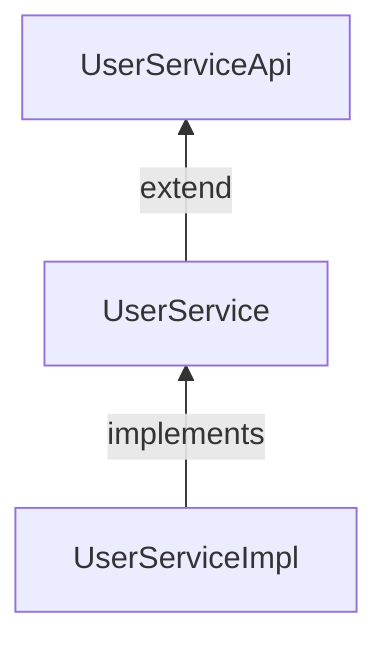

# 快速开发框架Spring-Cloud脚手架

## 微服务架构技术栈

配置中心与服务发现：NACOS

RPC框架：Dubbo

缓存中间件：RESID

SpringCloud版本：Hoxton.SR12

### 快速开始

#### demo工程

http://172.16.40.153:4999/web/#/25/178

#### 工程与包说明

- [脚手架配置](http://172.16.40.153:4999/web/#/25/203)，讲解了如何快速创建cloud工程，以及对应的包目录信息。

- [NACOS动态配置](http://172.16.40.153:4999/web/#/25/226)
  ，解释了为何脚手架项目下的Spring配置为何分为`bootstrap.yml`、`boostrap-local.yml`、`bootstrap-dynamic.yml`。

## SSM架构整体流程

### controller定义

基础父类`CustomBaseController`,如果只是涉及到简单的增删改查可基层，但是对于分页方法不对外暴露，仅定义`getPageSupport`
，可按需调用。

```java

@Api(tags = "demo用户操作")
@RestController
@RequestMapping("demo")
public class DemoController extends CustomBaseController<UserInfo> {

    /**
     * 用户信息逻辑层
     */
    private final UserService userService;

    public DemoController(UserService baseService) {
        super(baseService);
        this.userService = baseService;
    }


    @PostMapping("mpage")
    @ApiOperation("用户信息分页(单表关联)")
    public RestResponse<PageConditionQuery<? extends UserInfo>> getPage1(@RequestBody PageConditionQuery<UserQueryDTO> conditionDTO) {
        return super.getPageSupport(conditionDTO);
    }

}
```

### 查询类定义

@QueryField用来定义查询的方式，涵盖了大部分的查询条件，默认是EQ，具体可看[说明](http://172.16.40.153:4999/web/#/25/182)

```java
package net.evecom.demo.model.dto.query;

import net.evecom.fastdev.mybatis.annotation.ConditionOperation;
import net.evecom.fastdev.mybatis.annotation.QueryField;

/**
 * <P><B>用户查询类:</B></P>
 * RevisionTrail:(Date/Author/Description)
 * 2022年09月13日 CREATE
 *
 * @author Japson Huang
 * @version1.0
 */
public class UserQueryDTO {

    /**
     * 用户名称
     */
    @QueryField(condition = ConditionOperation.LIKE)
    private String userName;


    public String getUserName() {
        return userName;
    }

    public void setUserName(String userName) {
        this.userName = userName;
    }
}

```

### Service定义

因为微服务采用dubbo的方式，会有一部分方法提供给其他服务使用，所以采用如下的继承方式。这么定义的原因是，大部分接口都不都不是对其他服务提供的，只有部分才是对外提供，因为全都对外提供，容易造成接口被滥用，还有就是太多接口容易造成调用混乱。

<mark>如果不需要对外提供则无需定义Dubbo的接口</mark>



```java
public interface DubboUserService {

    /**
     *获取用户明细
     *RevisionTrail:(Date/Author/Description)
     * 2022年09月13日
     *@author Japson Huang
     *
     */
    UserDTO getUserDetail(Long id);
}
---------------------------------------------------------------------------------------------------------------

public interface UserService extends DubboUserService, BaseService<Long, UserInfo> {

    IPage<UserDTO> getUserPage(PageConditionDTO<UserQuery2DTO> pageConditionDTO);

}

---------------------------------------------------------------------------------------------------------------

//这里是表示发布DubboUserService对应的实现方法
@DubboService(interfaceClass = DubboUserService.class)
@Service
public class UserServiceImpl extends BaseServiceImpl<Long, UserInfo> implements UserService {

    @Override
    public IPage<UserDTO> getUserPage(PageConditionDTO<UserQuery2DTO> pageConditionDTO) {
        return userInfoDAO.getUserPage(pageConditionDTO, pageConditionDTO.buildQueryWrapper());
    }

    @Override
    public UserDTO getUserDetail(Long id) {
        return userInfoDAO.getUserDetail(id);
    }
}

```

**如果逻辑层遇到不符合条件的信息，请直接往上抛出异常（`CommonException`类和其子类，可自己实现对应的异常）Spring会统一捕获，统一处理和返回。
**

## DAO定义

Data Access Object，持久层类。基础基类`BaseMapperExtend`，里面包含了几个额外扩展的方法，如果无需，可直接继承`BaseMapper`
,因为Mybatis再启动时候，会构建实现方法，一点都没用到`BaseMapper`或者`BaseMapperExtend`里面的方法，则不要继承。<mark>
请秉持一个原则，无用则不用</mark>。

```java
@Mapper
public interface UserInfoDAO extends BaseMapperExtend<UserInfo> {

    /**
     *组合用户分页信息
     *RevisionTrail:(Date/Author/Description)
     * 2022年09月13日
     *@author Japson Huang
     *
    */
    IPage<UserDTO> getUserPage(IPage page, @Param(Constants.WRAPPER)QueryWrapper queryWrapper);

    /**
     *获取用户信息
     *RevisionTrail:(Date/Author/Description)
     * 2022年09月13日
     *@author Japson Huang
     *
    */
    UserDTO getUserDetail(Long id);
}
```

XML的定义有个特别的[技巧](http://172.16.40.153:4999/web/#/25/232)，`${ew.customSqlSegment}`这个就是`QueryWrapper`
的结果，而`QueryWrapper`可以从`UserQueryDTO`查询类转换而来，

这样我们就可以自定义查询SQL，然后通过查询类进行构建`where`条件

```xml
<?xml version="1.0" encoding="utf-8" ?>
<!DOCTYPE mapper PUBLIC "-//mybatis.org//DTD Mapper 3.0//EN" "http://mybatis.org/dtd/mybatis-3-mapper.dtd" >
<mapper namespace="net.evecom.demo.dao.UserInfoDAO">

    <select id="getUserPage" resultType="net.evecom.demo.model.dto.UserDTO">
        SELECT u.user_name,u.email,u.user_type,u.password,ui.address FROM user_info u
        left join user_info_detail ui on u.id=ui.user_id
         ${ew.customSqlSegment}
    </select>
    <select id="getUserDetail" resultType="net.evecom.demo.model.dto.UserDTO">
        SELECT u.user_name,u.email,u.user_type,u.password,ui.address,u.id, ui.id as uid
         FROM user_info u
         left join user_info_detail ui on u.id=ui.user_id
        WHERE U.ID = #{id}
    </select>

    <resultMap id="userDetail" type="net.evecom.demo.model.dto.UserDTO" autoMapping="true">
        <id property="id" column="id"/>
        <association property="userDTO" autoMapping="true">
            <id property="id" column="uid"/>
        </association>
    </resultMap>
</mapper>

```

### 实体类定义

实体类基类有两个，普通基类`DataEntity`和带租户标识的基类`TenantEntity`，实体类请保持干净，与数据库中表一一对应，如果有额外字段，请定义DTO。

```java
@ApiModel("用户信息")
@TableName("user_info")
public class UserInfo extends DataEntity {

    /**
     * 主键
     */
    @TableId
    private Long id;

    /**
     * 用户名称
     */
    @ApiModelProperty("用户名称")
    @TableField("user_name")
    @NotNull
    private String userName;

    /**
     * 密码
     */
    @ApiModelProperty("密码")
    @TableField("password")
    @Encrypt(EncryptType.SM4)
    private String password;

    /**
     * 用户类型
     */
    @ApiModelProperty("用户类型")
    @TableField("user_type")
    private UserType userType;
    /**
     * 邮箱
     */
    @ApiModelProperty("邮箱")
    @TableField("email")
    @NotNull(groups = Insert.class)
    private String email;
    
    ...get()set()
    
}
```

## 其他

### debugger模式

这个模式主要是为了开发者方便的模式，可以自定义用户的信息，无需再通过登录后的网关里面获取，具体可看文档中[开发配置](http://172.16.40.153:4999/web/#/25/200)

### 获取用户信息

`UserContext`,这个类可以再应用中获取用户信息，注意，如果是debug的模式下，获取的就是debug配置的用户信息。

### 工具类

工具类已经集成了lang3 和[hutool](https://doc.hutool.cn/pages/index/)，可查对应的文档，如果有比较大型的工具，可一起商讨，请勿重复造轮子。

### 调用其他服务

调用其他服务的话一般都是调用对应的dubbo服务，如果该服务不提供接口，有两种方案

- 让对应的服务提供！
- 使用resttemplate，具体用法如下

```java

@Autowired
RestTemplate restTemplate

//serviceName是对应的服务名称，无需写IP，因为已经注册到NACOS，会自动到NACOS解析对应的IP+PORT    
public void test(){
    restTemplate.post("serviceName/api/ds")
}
```

---

以上为最最基础的开发流程，更详细的请看[开发文档](http://172.16.40.153:4999/web/#/25/178)